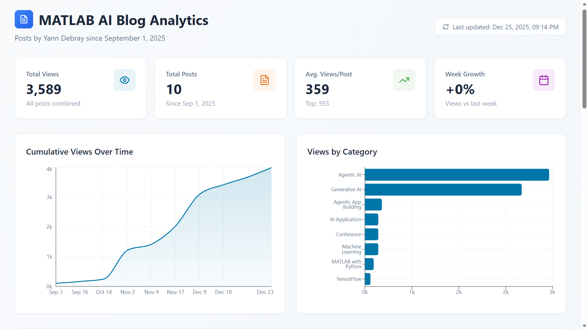

# MATLAB AI Blog Dashboard

A dashboard to track views for blog posts from the [MATLAB AI Blog](https://blogs.mathworks.com/deep-learning/) by Yann Debray since September 1, 2025.



## Features

- 📊 **Real-time view tracking** - Daily updates via GitHub Actions
- 📈 **Trend visualization** - See how views grow over time
- 🏷️ **Category analysis** - Understand which topics perform best
- 📱 **Responsive design** - Works on desktop and mobile
- 🎨 **MathWorks branding** - Uses official brand colors

## Posts Tracked

| Post | Date | Categories |
|------|------|------------|
| Antigravity + MATLAB is wicked good | Dec 24, 2025 | Agentic AI |
| Winning a Predictive Maintenance Data Challenge | Dec 16, 2025 | AI Application, Conference |
| MATLAB MCP Core Server Update | Dec 11, 2025 | Agentic AI, Generative AI |
| MATLAB MCP Client on GitHub | Dec 10, 2025 | Agentic AI, Generative AI |
| MATLAB MCP Core Server & Hardware | Nov 18, 2025 | Agentic AI, Generative AI |
| MATLAB MCP servers for quant agent | Nov 10, 2025 | Agentic AI |
| Releasing MATLAB MCP Core Server | Nov 3, 2025 | Agentic AI, Generative AI |
| MATLAB on GitHub Codespaces | Oct 15, 2025 | Cloud AI |
| pip & uv in MATLAB Online | Sep 17, 2025 | MATLAB Online, PyTorch |
| MATLAB on Google Colab | Sep 4, 2025 | MATLAB with Python, TensorFlow |

## Setup

### Prerequisites

- Python 3.10+
- Node.js 18+ (for dashboard)
- GitHub repository

### Installation

```bash
# Clone the repository
git clone https://github.com/your-username/matlab-blog-dashboard.git
cd matlab-blog-dashboard

# Install Node.js dependencies (for dashboard)
npm install

# Run development server
npm run dev
```

> **Note:** The Python scraper uses only standard library modules - no `pip install` required.

## Blog Post Scraper

The `fetch_blog_posts.py` script automatically discovers and scrapes all posts by Yann Debray from the MATLAB AI Blog. Posts are dynamically discovered via RSS feeds - no need to manually add new posts.

### Usage

```bash
python fetch_blog_posts.py
```

### Options

| Flag | Description |
|------|-------------|
| `--dry-run` | Preview results without writing to file |
| `--use-cache` | Use cached RSS data if available |

### How It Works

1. Fetches RSS feeds from the MATLAB AI Blog
2. Filters posts by author (Yann Debray) and date (>= September 1, 2025)
3. Extracts metadata: title, date, URL, categories
4. Fetches view counts from each individual blog post page
5. Merges with existing `posts.json` to preserve view history
6. Outputs updated `posts.json`

### Network Requirements

The MathWorks blog uses Akamai CDN with bot protection that may block automated requests from some networks.

| Environment | Status |
|-------------|--------|
| GitHub Actions | Works reliably |
| MathWorks VPN | Works |
| Home network | May be blocked (403) |

When blocked locally, the script gracefully falls back to using existing data from `posts.json`.

### GitHub Actions Setup

1. Go to repository Settings → Secrets and variables → Actions
2. Add required secrets for your analytics source
3. The workflow runs daily at 6:00 AM UTC
4. Manually trigger via Actions tab → "Update Blog Dashboard" → "Run workflow"

### Deployment

The dashboard auto-deploys to GitHub Pages on each update.

Enable GitHub Pages:
1. Go to repository Settings → Pages
2. Set Source to "GitHub Actions"

## Project Structure

```
matlab-blog-dashboard/
├── .github/
│   └── workflows/
│       └── deploy.yml              # Build & deploy to GitHub Pages
├── src/
│   ├── BlogDashboard.jsx           # React dashboard component
│   ├── main.jsx                    # React entry point
│   └── index.css                   # Tailwind CSS styles
├── fetch_blog_posts.py             # Python scraper (RSS + view counts)
├── posts.json                      # Blog posts and view data
├── index.html                      # Vite HTML entry point
├── vite.config.js                  # Vite configuration
├── tailwind.config.js              # Tailwind CSS configuration
├── postcss.config.js               # PostCSS configuration
├── package.json                    # Node.js dependencies
└── README.md
```

## Customization

### Adding New Posts

New posts are **automatically discovered** when you run `fetch_blog_posts.py`. The script scrapes RSS feeds and finds all posts by Yann Debray published after September 1, 2025.

To change the author or start date, edit the configuration in `fetch_blog_posts.py`:

```python
AUTHOR_NAME = "Yann Debray"
START_DATE = datetime(2025, 9, 1)  # September 1st, 2025
```

### Styling

Colors are defined in the `COLORS` object in the dashboard component. The default uses MathWorks brand colors:

```javascript
const COLORS = {
  primary: '#0076A8',      // MathWorks Blue
  secondary: '#E87722',    // MathWorks Orange
  // ...
};
```

## License

MIT License - Feel free to adapt for your own blog analytics!

---

Built with ❤️ for the MATLAB AI Blog
